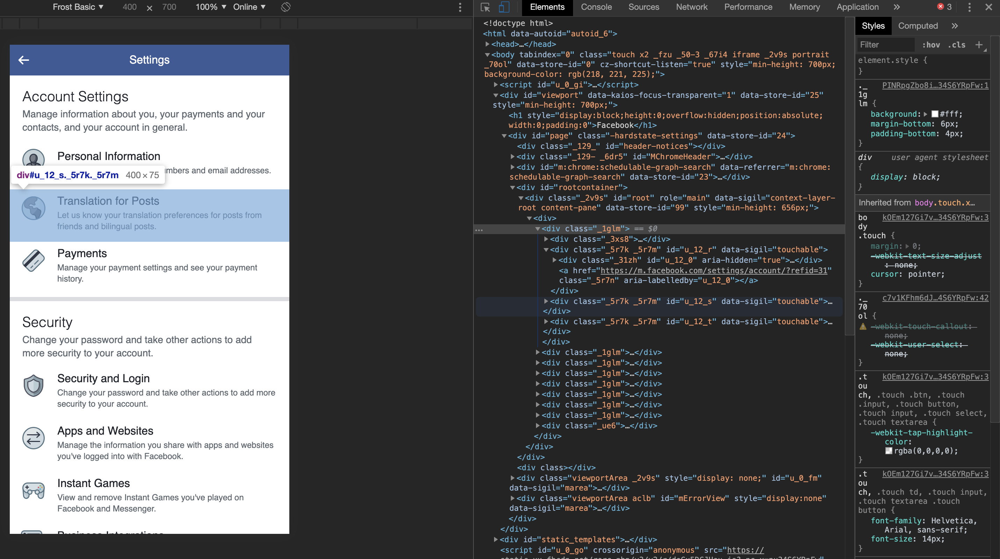

# Frost Theming

Want to contribute to Frost's theme? Read on!

## Inspect Element

Browsers have an inspect element panel, which you can use to view the underlying css. 
You can usually access this by right clicking an element, followed by inspect:

> Example using https://touch.facebook.com/settings/?entry_point=bookmark

Within the inspect element panel, we can go to the "Elements" tab, and see that the highlighted element has a white background caused by the css attribute `._1glm`. These elements are generated from Facebook's base theme, which is why they have weird naming schemes, and may change from time to time.

Frost primarily focuses on three attributes, `background` for background colors, `color` for text colors, and `border-*` for various border colors.

In the case of providing theme updates, identifying the relevant selectors will help fix unthemed elements.

## Updating Frost Themes

It is also useful to apply Frost's existing themes to see what is already configured and what is missing. To do so, I use the following tools:

* [Visual Studio Code](https://code.visualstudio.com/) as the main IDE
* [CSS & JS Injection](https://chrome.google.com/webstore/detail/css-and-javascript-inject/ckddknfdmcemedlmmebildepcmneakaa) or any other plugin that allows you to apply CSS to a web page.

When opening the Frost project, navigating to `app/web` and install the npm packages. Run SASS to generate the files, and focus on `app/web/assets/css/core/core.css`; this is what you'll want to paste into the browser extension to see the updates. To update the theme, modify one of the `app/web/scss/core/_core_*.scss` files, which will update `core.css`. 

If the update works, the selected elements should change.
Note that the core theme is intentionally a mix of weird colors, to make it easier to see changes.
